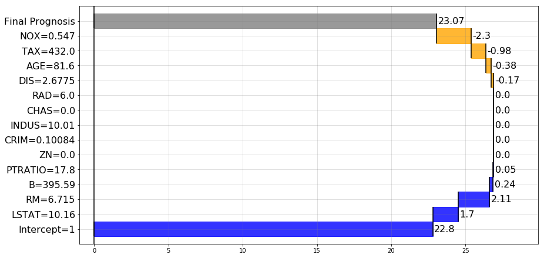

pyBreakDown
===========

Python implementation of breakDown package
(https://github.com/pbiecek/breakDown).

------------
Introduction
------------

Installation
------------
Install directly from github
::

    git clone https://github.com/bondyra/pyBreakDown
    cd pyBreakDown
    pip install .

----------------
Quick user guide
----------------

Example usage for decision tree regressor
-----------------------------------------

.. code:: python

    from pyBreakDown import explainer as e

Load and prepare data
~~~~~~~~~~~~~~~~~~~~~

.. code:: python

    from sklearn import datasets
    x = datasets.load_boston()

Train any sklearn model

.. code:: python

    from sklearn import tree
    clf = tree.DecisionTreeRegressor()
    clf = clf.fit(x.data, x.target)

Create explainer object
~~~~~~~~~~~~~~~~~~~~~~~

.. code:: python

    explainer = e.Explainer(clf, x.data, x.feature_names)

Explain using "go up" method:
~~~~~~~~~~~~~~~~~~~~~~~~~~~~~

.. code:: python

    exp = explainer.explain(observation=x.data[111,:], direction="up", baseline=0)

Show text results:
~~~~~~~~~~~~~~~~~~

.. code:: python

    exp.text()

::

    Feature                  Contribution        Cumulative          
    Intercept = 1            22.8                22.8                
    LSTAT = 10.16            1.7                 24.5                
    RM = 6.715               2.11                26.61               
    B = 395.59               0.24                26.85               
    PTRATIO = 17.8           0.05                26.9                
    ZN = 0.0                 0.0                 26.9                
    CRIM = 0.10084           0.0                 26.9                
    INDUS = 10.01            0.0                 26.9                
    CHAS = 0.0               0.0                 26.9                
    RAD = 6.0                0.0                 26.9                
    DIS = 2.6775             -0.17               26.73               
    AGE = 81.6               -0.38               26.35               
    TAX = 432.0              -0.98               25.37               
    NOX = 0.547              -2.3                23.07               
    Final prediction                             23.07               
    Baseline = 0

Text results can be customized:
~~~~~~~~~~~~~~~~~~~~~~~~~~~~~~~

.. code:: python

    exp.text(fwidth=30, contwidth=20, cumulwidth=20, digits=4)

::

    Feature                       Contribution        Cumulative          
    Intercept = 1                 22.8                22.8                
    LSTAT = 10.16                 1.6998              24.4998             
    RM = 6.715                    2.1085              26.6083             
    B = 395.59                    0.2413              26.8496             
    PTRATIO = 17.8                0.0504              26.9                
    ZN = 0.0                      0.0032              26.9032             
    CRIM = 0.10084                0.0                 26.9032             
    INDUS = 10.01                 0.0                 26.9032             
    CHAS = 0.0                    0.0                 26.9032             
    RAD = 6.0                     0.0                 26.9032             
    DIS = 2.6775                  -0.1692             26.734              
    AGE = 81.6                    -0.3806             26.3534             
    TAX = 432.0                   -0.9826             25.3708             
    NOX = 0.547                   -2.3036             23.0672             
    Final prediction                                  23.0672             
    Baseline = 0

Visualize explanation
~~~~~~~~~~~~~~~~~~~~~

.. code:: python

    exp.visualize()

Figure can be saved to a file:
~~~~~~~~~~~~~~~~~~~~~~~~~~~~~~

.. code:: python

    exp.visualize(filename="fig.png",dpi=90)

Another method of explanation, using "go down" approach:
~~~~~~~~~~~~~~~~~~~~~~~~~~~~~~~~~~~~~~~~~~~~~~~~~~~~~~~~

.. code:: python

    explainer.explain(observation=x.data[123,:], direction="down", baseline=0).visualize()

.. figure:: images/output_22_0.png
   :alt: png

Use intercept as baseline:
~~~~~~~~~~~~~~~~~~~~~~~~~~

.. code:: python

    explainer.explain(observation=x.data[100,:], direction="up", useIntercept=True).visualize()

.. figure:: images/output_24_0.png
   :alt: png