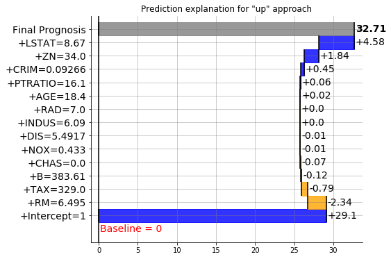
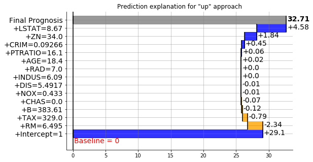
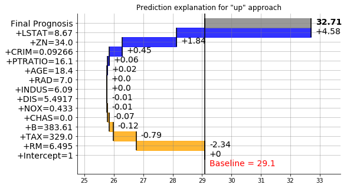

Usage
=====

Requirements
------------

Nothing fancy, just python 3.5.2+ and pip.

Installation
------------

Install directly from github

::

        git clone https://github.com/bondyra/pyBreakDown
        cd ./pyBreakDown
        python3 setup.py install  # (or use pip install . instead)

Basic usage
-----------

Load dataset
~~~~~~~~~~~~

.. code:: python

    from sklearn import datasets

.. code:: python

    x = datasets.load_boston()

.. code:: python

    data = x.data

.. code:: python

    feature_names = x.feature_names

.. code:: python

    y = x.target

Prepare model
~~~~~~~~~~~~~

.. code:: python

    import numpy as np

.. code:: python

    from sklearn import tree

.. code:: python

    model = tree.DecisionTreeRegressor()

Train model
~~~~~~~~~~~

.. code:: python

    train_data = data[1:300,:]
    train_labels=y[1:300]

.. code:: python

    model = model.fit(train_data,y=train_labels)

Explain predictions on test data
~~~~~~~~~~~~~~~~~~~~~~~~~~~~~~~~

.. code:: python

    #necessary imports
    from pyBreakDown.explainer import Explainer
    from pyBreakDown.explanation import Explanation

.. code:: python

    #make explainer object
    exp = Explainer(clf=model, data=train_data, colnames=feature_names)

.. code:: python

    #make explanation object that contains all information
    explanation = exp.explain(observation=data[302,:],direction="up")

Text form of explanations
~~~~~~~~~~~~~~~~~~~~~~~~~

.. code:: python

    #get information in text form
    explanation.text()

::

    Feature                  Contribution        Cumulative          
    Intercept = 1            29.1                29.1                
    RM = 6.495               -1.98               27.12               
    TAX = 329.0              -0.2                26.92               
    B = 383.61               -0.12               26.79               
    CHAS = 0.0               -0.07               26.72               
    NOX = 0.433              -0.02               26.7                
    RAD = 7.0                0.0                 26.7                
    INDUS = 6.09             0.01                26.71               
    DIS = 5.4917             -0.04               26.66               
    ZN = 34.0                0.01                26.67               
    PTRATIO = 16.1           0.04                26.71               
    AGE = 18.4               0.06                26.77               
    CRIM = 0.09266           1.33                28.11               
    LSTAT = 8.67             4.6                 32.71               
    Final prediction                             32.71               
    Baseline = 0

.. code:: python

    #customized text form
    explanation.text(fwidth=40, contwidth=40, cumulwidth = 40, digits=4)

::

    Feature                                 Contribution                            Cumulative                              
    Intercept = 1                           29.1                                    29.1                                    
    RM = 6.495                              -1.9826                                 27.1174                                 
    TAX = 329.0                             -0.2                                    26.9174                                 
    B = 383.61                              -0.1241                                 26.7933                                 
    CHAS = 0.0                              -0.0686                                 26.7247                                 
    NOX = 0.433                             -0.0241                                 26.7007                                 
    RAD = 7.0                               0.0                                     26.7007                                 
    INDUS = 6.09                            0.0074                                  26.708                                  
    DIS = 5.4917                            -0.0438                                 26.6642                                 
    ZN = 34.0                               0.0077                                  26.6719                                 
    PTRATIO = 16.1                          0.0385                                  26.7104                                 
    AGE = 18.4                              0.0619                                  26.7722                                 
    CRIM = 0.09266                          1.3344                                  28.1067                                 
    LSTAT = 8.67                            4.6037                                  32.7104                                 
    Final prediction                                                                32.7104                                 
    Baseline = 0

Visual form of explanations
~~~~~~~~~~~~~~~~~~~~~~~~~~~

.. code:: python

    explanation.visualize()

   png

.. code:: python

    #customize height, width and dpi of plot
    explanation.visualize(figsize=(8,5),dpi=100)

   png

.. code:: python

    #for different baselines than zero
    explanation = exp.explain(observation=data[302,:],direction="up",useIntercept=True)  # baseline==intercept
    explanation.visualize(figsize=(8,5),dpi=100)

   png
